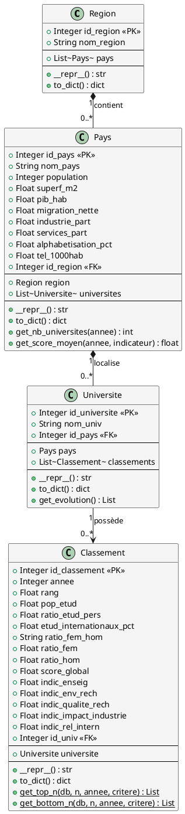

# Diagramme de Classes Python (SQLAlchemy ORM)

## Vue d'ensemble

Ce diagramme represente les classes Python utilisees pour mapper les tables de la base de donnees via **SQLAlchemy ORM**. Chaque classe correspond a une table et definit les attributs, methodes et relations.

## Diagramme de classes UML

## Description des classes

### Region

Represente une region geographique (ex: Western Europe, North America).

| Attribut    | Type    | Description                     |
|-------------|---------|---------------------------------|
| id_region   | Integer | Cle primaire                    |
| nom_region  | String  | Nom de la region (unique)       |
| pays        | List    | Relation vers les pays          |

### Pays

Represente un pays avec ses statistiques socio-economiques.

| Attribut           | Type    | Description                     |
|--------------------|---------|---------------------------------|
| id_pays            | Integer | Cle primaire                    |
| nom_pays           | String  | Nom du pays (unique)            |
| population         | Integer | Population totale               |
| superf_m2          | Float   | Superficie                      |
| pib_hab            | Float   | PIB par habitant                |
| migration_nette    | Float   | Solde migratoire                |
| industrie_part     | Float   | Part industrie                  |
| services_part      | Float   | Part services                   |
| alphabetisation_pct| Float   | Taux alphabetisation            |
| tel_1000hab        | Float   | Telephones/1000 hab             |
| id_region          | Integer | Cle etrangere vers Region       |
| region             | Region  | Relation vers Region            |
| universites        | List    | Relation vers Universite        |

### Universite

Represente une universite (entite stable).

| Attribut       | Type    | Description                     |
|----------------|---------|---------------------------------|
| id_universite  | Integer | Cle primaire                    |
| nom_univ       | String  | Nom de l'universite             |
| id_pays        | Integer | Cle etrangere vers Pays         |
| pays           | Pays    | Relation vers Pays              |
| classements    | List    | Relation vers Classement        |

### Classement

Represente le classement annuel d'une universite (donnees variables par annee).

| Attribut              | Type    | Description                     |
|-----------------------|---------|---------------------------------|
| id_classement         | Integer | Cle primaire                    |
| annee                 | Integer | Annee du classement             |
| rang                  | Float   | Rang dans le classement         |
| pop_etud              | Float   | Population etudiante            |
| ratio_etud_pers       | Float   | Ratio etudiants/personnel       |
| etud_internationaux_pct| Float  | % etudiants internationaux      |
| ratio_fem_hom         | String  | Ratio F/H (texte)               |
| ratio_fem             | Float   | Ratio femmes                    |
| ratio_hom             | Float   | Ratio hommes                    |
| score_global          | Float   | Score global THE                |
| indic_enseig          | Float   | Indicateur enseignement         |
| indic_env_rech        | Float   | Indicateur env. recherche       |
| indic_qualite_rech    | Float   | Indicateur qualite recherche    |
| indic_impact_industrie| Float   | Indicateur impact industrie     |
| indic_rel_intern      | Float   | Indicateur relations intern.    |
| id_univ               | Integer | Cle etrangere vers Universite   |
| universite            | Universite | Relation vers Universite     |

## Relations ORM

| Relation                 | Type | Symbole_UML |                                         Description                                      |
|--------------------------|------|-------------|------------------------------------------------------------------------------------------|
| Region -> Pays           | 1-n  |     *--     | Une région est composée de plusieurs pays. La suppression de la région impacte les pays. |
| Pays -> Universite       | 1-n  |     *--     | Un pays contient plusieurs universités de manière structurelle.                          |
| Universite -> Classement | 1-n  |     -->     | Une université possède plusieurs relevés de classements annuels historiques.             |

## Methodes metier

### Region

- `to_dict()` : Serialisation en dictionnaire

### Pays

- `to_dict()` : Serialisation en dictionnaire
- `get_nb_universites(annee)` : Nombre d'universites classees pour une annee
- `get_score_moyen(annee, indicateur)` : Score moyen d'un indicateur

### Universite

- `to_dict()` : Serialisation en dictionnaire
- `get_evolution()` : Evolution des scores au fil des annees

### Classement

- `to_dict()` : Serialisation en dictionnaire
- `get_top_n(db, n, annee, critere)` : Top N universites selon un critere
- `get_bottom_n(db, n, annee, critere)` : Bottom N universites selon un critere
