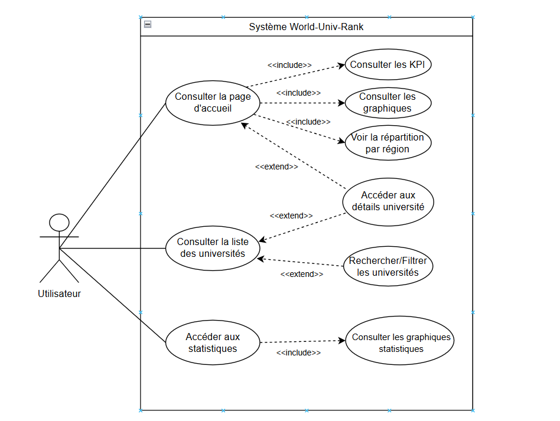

# Diagramme de Cas d'Utilisation (DCU)

## Vue d'ensemble

Le DCU du projet World-Univ-Rank identifie les acteurs et leurs interactions avec le systeme. Il definit les fonctionnalites principales de l'application web d'analyse des classements universitaires.

## Diagramme de Cas d'Utilisation
 

## Acteur

| Acteur      | Description                                                                 |
|-------------|-----------------------------------------------------------------------------|
| Utilisateur | Consulte, filtre et explore les donnees sur le classement des universites   |

## Cas d'usage

| ID  | Nom                              | Description                                              |
|-----|----------------------------------|----------------------------------------------------------|
| UC0 | Consulter la page d'accueil      | Point d'entree affichant KPI, graphiques et repartition  |
| UC1 | Consulter les KPI                | Indicateurs cles (nb universites, score moyen, etc.)     |
| UC2 | Consulter les graphiques         | Visualisations (top/bottom, comparaisons)                |
| UC3 | Voir la repartition par region   | Diagramme circulaire par region geographique             |
| UC4 | Consulter la liste des universites | Tableau avec pagination et actions                     |
| UC5 | Voir les details d'une universite | Page detaillee avec evolution et indicateurs            |
| UC6 | Rechercher / Filtrer             | Formulaire de filtrage (pays, annee, scores)             |
| UC7 | Acceder aux statistiques         | Page d'analyses socio-economiques                        |
| UC8 | Consulter les graphiques stats   | Visualisations de la page Statistiques                   |

## Relations

| Type      | Source | Cible | Description                                           |
|-----------|--------|-------|-------------------------------------------------------|
| include   | UC0    | UC1   | La page d'accueil affiche les KPI                     |
| include   | UC0    | UC2   | La page d'accueil affiche les graphiques              |
| include   | UC0    | UC3   | La page d'accueil affiche le pie chart                |
| include   | UC4    | UC6   | La liste inclut le formulaire de recherche/filtre     |
| extend    | UC5    | UC4   | Les details sont accessibles depuis la liste          |
| include   | UC7    | UC8   | La page Statistiques affiche ses graphiques           |

## Description des cas d'usage

### UC0 - Page d'accueil

**Objectif** : Fournir une vue synthetique du projet

**Scenario principal** :

1. L'utilisateur accede a la page d'accueil
2. Le systeme affiche les KPI (UC1)
3. Le systeme affiche les graphiques principaux (UC2)
4. Le systeme affiche la repartition par region (UC3)

### UC4 - Liste des universites

**Objectif** : Permettre l'exploration des universites

**Scenario principal** :

1. L'utilisateur accede a la liste des universites
2. Le systeme affiche un tableau pagine
3. L'utilisateur peut utiliser les filtres (UC6)
4. L'utilisateur peut cliquer sur "Details" (UC5)

### UC5 - Details d'une universite

**Objectif** : Afficher les informations detaillees

**Scenario principal** :

1. L'utilisateur clique sur "Details" depuis la liste
2. Le systeme affiche la page /universite/<id>
3. Le systeme affiche les indicateurs de l'universite
4. Le systeme affiche le graphique d'evolution

### UC7 - Page Statistiques

**Objectif** : Analyser les correlations socio-economiques

**Scenario principal** :

1. L'utilisateur accede a la page Statistiques
2. Le systeme affiche les graphiques d'analyse (UC8)
3. L'utilisateur peut explorer les correlations :
   - PIB vs indicateurs universitaires
   - Alphabetisation vs score global
   - Internationalisation vs recherche
