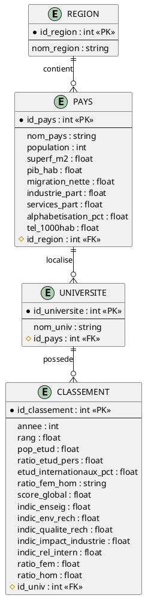

# Modele Conceptuel de Donnees (MCD)

## Vue d'ensemble

Le MCD du projet World-Univ-Rank represente les entites principales et leurs relations pour analyser les performances universitaires mondiales en lien avec les facteurs socio-economiques.

## Diagramme Entite-Relation

## Description des entites

### REGION
| Attribut    | Description                        |
|-------------|------------------------------------|
| id_region   | Identifiant unique de la region (PK) |
| nom_region  | Nom de la region geographique      |

### PAYS
| Attribut           | Description                              |
|--------------------|------------------------------------------|
| id_pays            | Identifiant unique du pays (PK)          |
| nom_pays           | Nom du pays                              |
| population         | Population totale                        |
| superf_m2          | Superficie en m2                         |
| pib_hab            | PIB par habitant                         |
| migration_nette    | Solde migratoire                         |
| industrie_part     | Part de l'industrie dans le PIB          |
| services_part      | Part des services dans le PIB            |
| alphabetisation_pct| Taux d'alphabetisation                   |
| tel_1000hab        | Telephones pour 1000 habitants           |
| id_region          | Cle etrangere vers REGION (FK)           |

### UNIVERSITE
| Attribut       | Description                          |
|----------------|--------------------------------------|
| id_universite  | Identifiant unique de l'universite (PK) |
| nom_univ       | Nom de l'universite                  |
| id_pays        | Cle etrangere vers PAYS (FK)         |

### CLASSEMENT
| Attribut              | Description                              |
|-----------------------|------------------------------------------|
| id_classement         | Identifiant unique du classement (PK)    |
| annee                 | Annee du classement                      |
| rang                  | Rang dans le classement                  |
| pop_etud              | Population etudiante                     |
| ratio_etud_pers       | Ratio etudiants/personnel                |
| etud_internationaux_pct| Pourcentage d'etudiants internationaux  |
| ratio_fem_hom         | Ratio femmes/hommes (format texte)       |
| score_global          | Score global THE                         |
| indic_enseig          | Indicateur enseignement                  |
| indic_env_rech        | Indicateur environnement recherche       |
| indic_qualite_rech    | Indicateur qualite recherche             |
| indic_impact_industrie| Indicateur impact industrie              |
| indic_rel_intern      | Indicateur relations internationales     |
| ratio_fem             | Ratio femmes (numerique)                 |
| ratio_hom             | Ratio hommes (numerique)                 |
| id_univ               | Cle etrangere vers UNIVERSITE (FK)       |

## Relations

| Relation                 | Cardinalite | Description                                    |
|--------------------------|-------------|------------------------------------------------|
| REGION -> PAYS           | 1,n         | Une region contient plusieurs pays             |
| PAYS -> UNIVERSITE       | 1,n         | Un pays contient plusieurs universites         |
| UNIVERSITE -> CLASSEMENT | 1,n         | Une universite a plusieurs classements (annuels)|

## Avantages de ce modele

1. **Normalisation 3NF** : Separation claire entre universite et classements annuels
2. **Historisation** : Permet de suivre l'evolution d'une universite au fil des annees
3. **Pas de redondance** : Les donnees pays ne sont stockees qu'une fois
4. **Flexibilite** : Facile d'ajouter de nouvelles annees de classement

## Volumetrie estimee

| Entite     | Nombre estime |
|------------|---------------|
| REGION     | ~11           |
| PAYS       | ~115          |
| UNIVERSITE | ~2336         |
| CLASSEMENT | ~14522        |
