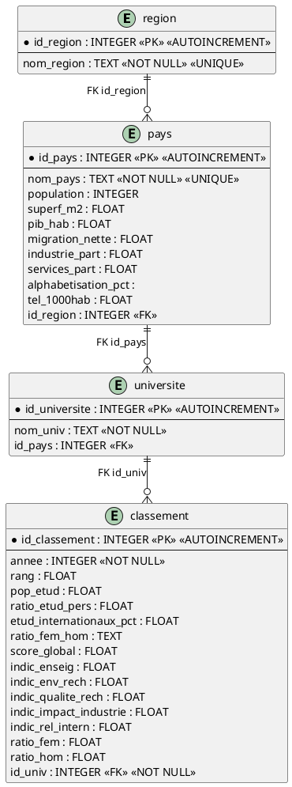

# Modele Logique de Donnees (MLD)

## Vue d'ensemble

Le MLD (Modele Logique de Donnees) represente la structure de la base de donnees SQLite pour le projet World-Univ-Rank. Il definit les tables, les colonnes, les types de donnees et les contraintes d'integrite.

## Schema relationnel



## Notation relationnelle

```text
REGION (id_region PK, nom_region)

PAYS (id_pays PK, nom_pays, population, superf_m2, pib_hab, migration_nette, 
      industrie_part, services_part, alphabetisation_pct, tel_1000hab, #id_region)

UNIVERSITE (id_universite PK, nom_univ, #id_pays)

CLASSEMENT (id_classement PK, annee, rang, pop_etud, ratio_etud_pers, 
            etud_internationaux_pct, ratio_fem_hom, score_global, indic_enseig,
            indic_env_rech, indic_qualite_rech, indic_impact_industrie, 
            indic_rel_intern, ratio_fem, ratio_hom, #id_univ)
```

## Index recommandes

```sql
CREATE INDEX idx_pays_region ON pays(id_region);
CREATE INDEX idx_universite_pays ON universite(id_pays);
CREATE INDEX idx_classement_univ ON classement(id_univ);
CREATE INDEX idx_classement_annee ON classement(annee);
CREATE INDEX idx_classement_univ_annee ON classement(id_univ, annee);
```

## Contraintes d'integrite

1. **Cles primaires** : Chaque table possede un identifiant unique auto-incremente
2. **Cles etrangeres** :
   - `pays.id_region` -> `region.id_region` (ON DELETE SET NULL)
   - `universite.id_pays` -> `pays.id_pays` (ON DELETE SET NULL)
   - `classement.id_univ` -> `universite.id_universite` (ON DELETE CASCADE)
3. **Unicite** : `nom_region` et `nom_pays` sont uniques
4. **Contrainte CHECK** : `annee` entre 2016 et 2030

## Volumetrie

| Table      | Nombre d'enregistrements |
|------------|--------------------------|
| region     | ~11                      |
| pays       | ~115                     |
| universite | ~2336                    |
| classement | ~14522                   |
